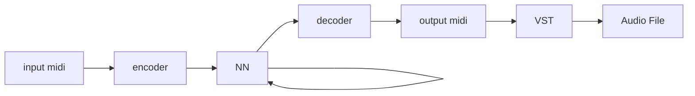

# Midi Generator



```
  |-----------------------|
  |           | KEY       |
  | --------- | --------- |
  | 0000 0000 | 0000 0000 |
                      255
  |-----------------------|
  | BPM       | TIME/SIG  |
  | --------- | --------- |
  | 0000 0000 | 0000 0000 |
          255     15   15
```

```
  |-----------------------|
  | STEP                  |
  | --------- | --------- |
  | 0000 0000 | 0000 0000 |
                    65535
  |-----------------------|
  | DR  VELO  |   PITCH   |
  | --------- | --------- |
  | 0000 0XXX | X000 0000 |
      31   \ 15/      127
```

- Pitch 127
- Velocity 127
- Step in ticks or seconds?
- Duration in ticks or seconds?

In a MIDI message, the maximum value for a note number is 127. This range defines the pitch of a musical note, from the lowest (0) to the highest (127) possible note.

In a MIDI message, the maximum velocity value is 127. This value represents the loudest or strongest note that can be played, with 0 being the quietest or silent.


> If a Note On event occurs at MIDI tick 0 and a Note Off event occurs at MIDI tick 1000, and the tempo is 120 BPM (24 ticks per beat), then the duration would be (1000 / 24) / (120 / 60) = 1000 / 24 / 2 = 20.8333 seconds.
> In summary, the duration of a note in a MIDI file is calculated by finding the difference between the Note Off and Note On times (in MIDI ticks), then converting that difference to seconds using the tempo and PPQN settings of the file

----

https://arxiv.org/abs/1810.12247

```
@inproceedings{
  hawthorne2018enabling,
  title={Enabling Factorized Piano Music Modeling and Generation with the {MAESTRO} Dataset},
  author={Curtis Hawthorne and Andriy Stasyuk and Adam Roberts and Ian Simon and Cheng-Zhi Anna Huang and Sander Dieleman and Erich Elsen and Jesse Engel and Douglas Eck},
  booktitle={International Conference on Learning Representations},
  year={2019},
  url={https://openreview.net/forum?id=r1lYRjC9F7},
}
```